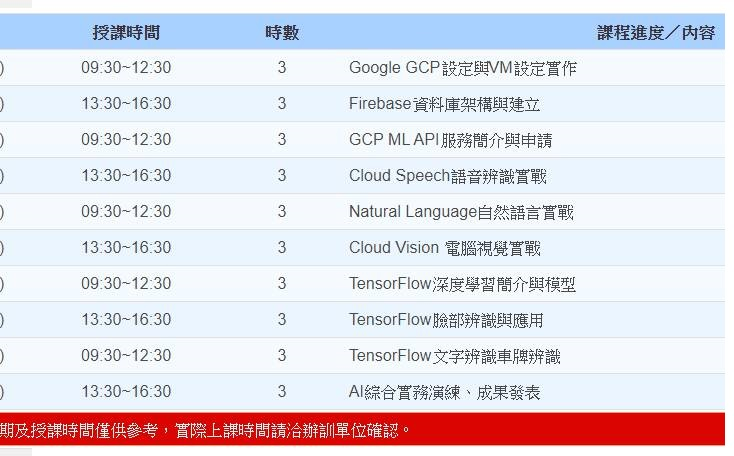
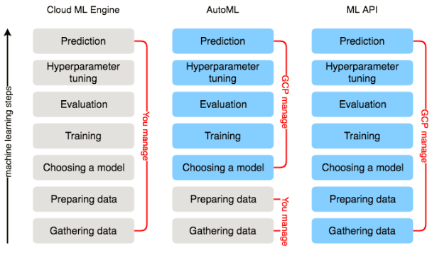
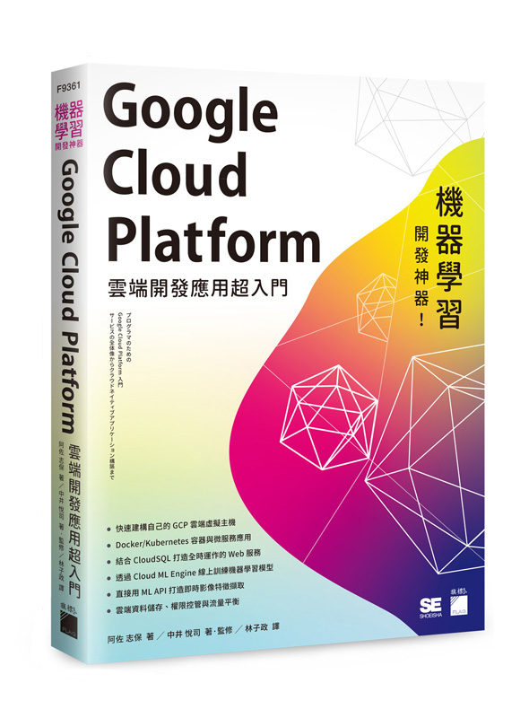
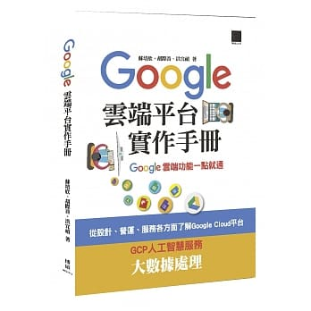

# gcp_class
##
#### 
##
## Day1
* LAB1: [註冊 Google Cloud Plateform](https://github.com/jumbokh/gcp_class/blob/master/GCP_%E8%A8%BB%E5%86%8A%E5%8F%8A%E5%BB%BA%E7%AB%8B%E5%B0%88%E6%A1%88.pptx)
##
* LAB2: [負載平衡](https://github.com/jumbokh/gcp_class/blob/master/Load_balance.md)
* [Creating a Virtual Machine](https://codelabs.developers.google.com/codelabs/cloud-create-a-vm/index.html?index=..%2F..index#0)
##
* LAB3: [FireBase: Get Start](https://codelabs.developers.google.com/codelabs/firebase-get-to-know-web/index.html?index=..%2F..index#0)
        [完成檔](https://github.com/jumbokh/gcp_class/tree/master/Source/firebase-gtk-web-start-wendj1_Done)
* LAB4: [練習題](https://codelabs.developers.google.com/codelabs/firebase-web/index.html?index=..%2F..index#0)
##
## Day 2
* [Google Cloud API](https://cloud.google.com/apis/docs/overview)
* [GCP ML API](https://blog.gcp.expert/google-cloud-automl-ml-engine-ml-api/)
* 
##
## Day 3
* [Using the Natural Language API with Python](https://codelabs.developers.google.com/codelabs/cloud-natural-language-python3/index.html?index=..%2F..index#0)
## 書籍

*  [連結](https://www.flag.com.tw/books/product/F9361)
*  [連結](https://www.books.com.tw/products/0010753986)

## 參考連結

* [懶人包】Google Cloud 基礎教學資源彙集](https://blog.gcp.expert/google-cloud-products-quick-start/)
* [Firebase 是什麼 ? 集 APP 後端開發與分析於一身的強大工具！](https://blog.gcp.expert/firebase-gcp/)
* [Get to Know Cloud Firestore #1](https://www.youtube.com/watch?time_continue=1&v=v_hR4K4auoQ&feature=emb_logo)
##
### Google CodeLab
* [End-to-end Machine Learning with Tensorflow on GCP](https://codelabs.developers.google.com/codelabs/end-to-end-ml/index.html?index=..%2F..cloudai#0)
* [
Integrating Machine Learning APIs](https://codelabs.developers.google.com/codelabs/cloud-ml-apis/index.html?index=..%2F..index#0)
* [Get to know Firebase for web](https://codelabs.developers.google.com/codelabs/firebase-get-to-know-web/index.html?index=..%2F..index#0)
* [Using the Vision API with Python](https://codelabs.developers.google.com/codelabs/cloud-vision-api-python/index.html?index=..%2F..cloudai#0)
* [End-to-end Machine Learning with Tensorflow on GCP](https://codelabs.developers.google.com/codelabs/end-to-end-ml/index.html?index=..%2F..cloudai#0)
* [Google Code on GITHUB](https://github.com/googlecodelabs/tools)
* [Cloud Firestore Web Codelab](https://codelabs.developers.google.com/codelabs/firestore-web/index.html?index=..%2F..index#0)
* [Detect objects in an Image using Firebase MLKit](https://codelabs.developers.google.com/codelabs/mlkit-image-objects-android/index.html?index=..%2F..index#0)
* [Train and deploy on-device image classification model with AutoML Vision in ML Kit](https://codelabs.developers.google.com/codelabs/automl-vision-edge-in-mlkit/index.html?index=..%2F..index#0)
* [Recognize text, facial features, and objects in images with ML Kit for Firebase: Android](https://codelabs.developers.google.com/codelabs/mlkit-android/index.html?index=..%2F..index#0)
##
