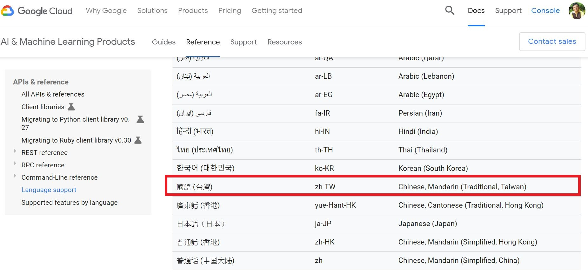
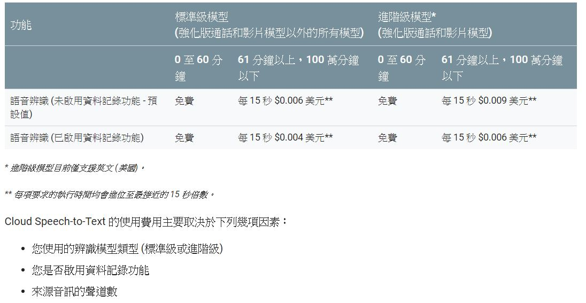

# gcp_class
##
#### 
##
* [python 開發環境安裝](https://cloud.google.com/python/setup?hl=zh-tw) 或是下載 [Winpython](https://drive.google.com/open?id=1t9CHzd1k4M9XEtVNBh_EJ4jdzdz56n0Z)
* [GCP SDK 安裝](https://cloud.google.com/sdk/docs/quickstart-windows?hl=zh-tw)
## Day 3
* LAB1 [快速入門：使用用戶端程式庫](https://cloud.google.com/natural-language/docs/quickstart-client-libraries?hl=zh-tw)
* [Natural Language](https://cloud.google.com/natural-language/?hl=zh_TW)
#### 參考:
* [doc: Cloud Natural Language API](https://cloud.google.com/natural-language/?hl=zh_TW)
* [ppt:朝樂門老師](https://github.com/jumbokh/gcp_class/blob/master/NLP/41%E8%87%AA%E7%84%B6%E8%AF%AD%E8%A8%80%E5%A4%84%E7%90%86.pptx)
* [图书《Python编程：从数据分析到数据科学》的配套资源](https://github.com/LemenChao/PythonFromDAToDS)
* [python code 自然語言處理](https://nbviewer.jupyter.org/github/jumbokh/gcp_class/blob/master/NLP/41.%E8%87%AA%E7%84%B6%E8%AF%AD%E8%A8%80%E5%A4%84%E7%90%86.ipynb)
* [GCP 機器學習(2) – Natural Language API 應用實例](https://blog.gcp.expert/machine-learning-natural-language-api/)
* [Using the Natural Language API with Python](https://codelabs.developers.google.com/codelabs/cloud-natural-language-python3/index.html?index=..%2F..index#0)
* [ppt: 語音聊天機器人](https://github.com/jumbokh/gcp_class/blob/master/NLP/FT700-ch15.ppt)
* [動手玩玩 GOOGLE CLOUD VISION API](https://www.mile.cloud/zh-hant/google-cloud-vision-api/)
##
## Day 2
* [speech to text](https://cloud.google.com/speech-to-text/docs/quickstart-protocol)
* [AI & Machine Learning](https://cloud.google.com/products/ai/?hl=zh-tw#more-ai-resources)
* [Google 機器學習三大服務](https://cloud.google.com/apis/docs/overview)
* [vision API](https://cloud.google.com/vision/?hl=zh-tw&utm_source=google&utm_medium=cpc&utm_campaign=japac-TW-all-zh-dr-bkws-all-super-trial-e-dr-1003987&utm_content=text-ad-none-none-DEV_c-CRE_263273745739-ADGP_Hybrid+%7C+AW+SEM+%7C+BKWS+~+T1+%7C+EXA+%7C+ML+%7C+1:1+%7C+TW+%7C+zh+%7C+Vision+%7C+google+cloud+vision+api+%7C+en-KWID_43700031887751273-kwd-203288731207&userloc_9040321&utm_term=KW_google%20cloud%20vision%20api&gclid=Cj0KCQiAl5zwBRCTARIsAIrukdPS_OnI7B_o8YEV4n--CYIOymZVVFKaFK-fzRH0rh9wIFQ-9RDaiowaAtnVEALw_wcB)
* [NL API](https://cloud.google.com/natural-language/?hl=zh-tw&utm_source=google&utm_medium=cpc&utm_campaign=japac-TW-all-en-dr-bkws-all-all-trial-b-dr-1003987&utm_content=text-ad-none-none-DEV_c-CRE_252375343168-ADGP_Hybrid+%7C+AW+SEM+%7C+BKWS+~+T1+%7C+BMM+%7C+ML+%7C+M:1+%7C+TW+%7C+en+%7C+Language+%7C+API-KWID_43700036898841807-kwd-490168509258&userloc_9040321&utm_term=KW_%2Bgoogle%20%2Bnl%20%2Bapi&gclid=Cj0KCQiAl5zwBRCTARIsAIrukdMj14wWmIR3rHXVslZigPlxh-uQ1kSEu9-tVQ9rJUKmE0XNASDdQ2YaAgUDEALw_wcB)
* [Google 機器學習三大服務：AutoML, Cloud ML Engine, ML API 介紹與比較](https://blog.gcp.expert/google-cloud-automl-ml-engine-ml-api/)
* [Google Cloud Auto ML Prices](https://cloud.google.com/skus/?hl=zh_TW&_ga=2.32958715.-492626677.1577098418&_gac=1.213815654.1577098418.Cj0KCQiA6IHwBRCJARIsALNjViVJF6XIuFJD_Wvf0LluZbusR7aGAK8QYhLihR2ocuZIB8CTVGsgGcoaAgPfEALw_wcB&currency=USD&filter=auto+ml)
* [APIs and Reference](https://cloud.google.com/natural-language/docs/apis)
* [Actions on Google: The developer platform for the Google Assistant.](https://developers.google.com/assistant)
* [Cloud Speech-to-text API 指南](https://cloud.google.com/speech-to-text/docs/how-to)
* [用於Firebase的ML套件](https://firebase.google.com/docs/ml-kit?authuser=0)
* [GCP ML API](https://blog.gcp.expert/google-cloud-automl-ml-engine-ml-api/)
* [範例應用程式](https://github.com/GoogleCloudPlatform/python-docs-samples/tree/master/speech/cloud-client)
* 
* 

##

* LAB1: [Good Cloud speech API](https://cloud.google.com/speech-to-text/?hl=zh-tw&utm_source=google&utm_medium=cpc&utm_campaign=japac-TW-all-zh-dr-bkws-all-super-trial-e-dr-1003987&utm_content=text-ad-none-none-DEV_c-CRE_263264846828-ADGP_Hybrid+%7C+AW+SEM+%7C+BKWS+~+T1+%7C+EXA+%7C+ML+%7C+1:1+%7C+TW+%7C+zh+%7C+Speech+%7C+google+cloud+speech+api+%7C+en-KWID_43700031887751063-kwd-203288730727&userloc_9040321&utm_term=KW_google%20cloud%20speech%20api&gclid=CjwKCAiA9JbwBRAAEiwAnWa4Q2L6JNb6JogBial2wAr81VYZ5u4OrRugpr-9YzFBBQZEU33BTpu_OxoC_gwQAvD_BwE)
* LAB1(參考): [Machine Learning(一)：Cloud Speech API 介紹與實作](https://blog.gcp.expert/machine-learning-cloud-speech-api/)
* [金鑰下載](https://cloud.google.com/speech-to-text/docs/reference/libraries)
##
* LAB2:[Cloud speech to text API](https://github.com/jumbokh/gcp_class/blob/master/Google_text-to-speech-API.md)
##
* LAB3:[在 Windows 下使用 Google Assistant](https://github.com/jumbokh/gcp_class/blob/master/Google_Assistant_Win10.md)
* [Your own Raspberry Pi Google Assistant](https://medium.com/@janne.spijkervet/your-own-raspberry-pi-google-assistant-1434be9eac99)
* [How to Get Google Assistant for PC](https://www.lifewire.com/google-assistant-on-windows-4628292)
##
* LAB4: [轉錄短音訊檔案](https://cloud.google.com/speech-to-text/docs/sync-recognize#speech-sync-recognize-python)

##
## Day1
* LAB1: [註冊 Google Cloud Plateform](https://github.com/jumbokh/gcp_class/blob/master/GCP_%E8%A8%BB%E5%86%8A%E5%8F%8A%E5%BB%BA%E7%AB%8B%E5%B0%88%E6%A1%88.pptx)
##
* [[GCP]Google Cloud Platform架站(6) - 外部IP查詢與靜態IP設定](https://robarter.pixnet.net/blog/post/223287133-%5Bgcp%5Dgoogle%E9%9B%B2%E7%AB%AF%E6%9E%B6%E7%AB%99---%E5%A4%96%E9%83%A8ip%E6%9F%A5%E8%A9%A2%E8%88%87%E9%9D%9C%E6%85%8Bip%E8%A8%AD%E5%AE%9A)
* LAB2: [負載平衡](https://github.com/jumbokh/gcp_class/blob/master/Load_balance.md)
* [Creating a Virtual Machine](https://codelabs.developers.google.com/codelabs/cloud-create-a-vm/index.html?index=..%2F..index#0)
##
* LAB3: [FireBase: Get Start](https://codelabs.developers.google.com/codelabs/firebase-get-to-know-web/index.html?index=..%2F..index#0)
        [完成檔](https://github.com/jumbokh/gcp_class/tree/master/Source/firebase-gtk-web-start-wendj1_Done)
* LAB4: [練習題](https://codelabs.developers.google.com/codelabs/firebase-web/index.html?index=..%2F..index#0)
##

## 書籍

*  [連結](https://www.flag.com.tw/books/product/F9361)
*  [連結](https://www.books.com.tw/products/0010753986)

## 參考連結

* [懶人包】Google Cloud 基礎教學資源彙集](https://blog.gcp.expert/google-cloud-products-quick-start/)
* [Firebase 是什麼 ? 集 APP 後端開發與分析於一身的強大工具！](https://blog.gcp.expert/firebase-gcp/)
* [Get to Know Cloud Firestore #1](https://www.youtube.com/watch?time_continue=1&v=v_hR4K4auoQ&feature=emb_logo)
* [The 7 Steps of Machine Learning (AI Adventures)](https://www.youtube.com/watch?v=nKW8Ndu7Mjw&feature=emb_logo)
* [From Zero to ML on Google Cloud Platform (Cloud Next '18)](https://www.youtube.com/watch?v=QU7_eU8HzAQ)
##
### Google CodeLab
* [End-to-end Machine Learning with Tensorflow on GCP](https://codelabs.developers.google.com/codelabs/end-to-end-ml/index.html?index=..%2F..cloudai#0)
* [Integrating Machine Learning APIs](https://codelabs.developers.google.com/codelabs/cloud-ml-apis/index.html?index=..%2F..index#0)
* [Get to know Firebase for web](https://codelabs.developers.google.com/codelabs/firebase-get-to-know-web/index.html?index=..%2F..index#0)
* [Using the Vision API with Python](https://codelabs.developers.google.com/codelabs/cloud-vision-api-python/index.html?index=..%2F..cloudai#0)
* [End-to-end Machine Learning with Tensorflow on GCP](https://codelabs.developers.google.com/codelabs/end-to-end-ml/index.html?index=..%2F..cloudai#0)
* [Google Code on GITHUB](https://github.com/googlecodelabs/tools)
* [A sample of the Smart Home device control APIs in Actions on Google](https://github.com/actions-on-google/smart-home-nodejs)
* [Cloud Firestore Web Codelab](https://codelabs.developers.google.com/codelabs/firestore-web/index.html?index=..%2F..index#0)
* [Detect objects in an Image using Firebase MLKit](https://codelabs.developers.google.com/codelabs/mlkit-image-objects-android/index.html?index=..%2F..index#0)
* [Train and deploy on-device image classification model with AutoML Vision in ML Kit](https://codelabs.developers.google.com/codelabs/automl-vision-edge-in-mlkit/index.html?index=..%2F..index#0)
* [Recognize text, facial features, and objects in images with ML Kit for Firebase: Android](https://codelabs.developers.google.com/codelabs/mlkit-android/index.html?index=..%2F..index#0)
##
